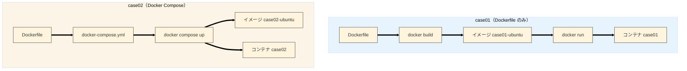

# case01 と case02 の比較 — Ubuntu コンテナの2つの立ち上げ方

同じ Ubuntu 24.04 コンテナを **2つのやり方** で立ち上げ、違いを比較する記事です。

| | case01 | case02 |
|---|---|---|
| 方式 | `Dockerfile` のみ | `Dockerfile` + `docker-compose.yml` |
| 起動 | `docker build` → `docker run` | `docker compose up` |
| 向いている用途 | 基本の学習・単一コンテナ | 設定の一元管理・複数コンテナへの拡張 |

```
c:\AdTechCode\Docker\
├── case01\
│   └── Dockerfile
└── case02\
    ├── Dockerfile
    └── docker-compose.yml
```

**前提:** Docker Desktop が起動済みで、`docker --version` と `docker compose version` が通ること。

---

## 比較の全体像



| 比較項目 | case01 | case02 |
|----------|--------|--------|
| 設定ファイル | `Dockerfile` のみ | `Dockerfile` + `docker-compose.yml` |
| ビルド | `docker build` を手動 | `docker compose up --build` で自動 |
| 起動 | `docker run` を手動 | `docker compose up` で自動 |
| 停止 | `docker stop case01` | `docker compose down` |
| 状態確認 | `docker ps --filter name=case01` | `docker compose ps` |
| コンテナに入る | `docker exec -it case01 bash` | `docker exec -it case02 bash`（共通） |

**ポイント:** どちらも Dockerfile の中身は同じ。違いは **ビルド・起動・停止をコマンドで逐次書くか、YAML にまとめるか** だけです。

---

## 共通：Dockerfile

case01・case02 とも同一内容です。

```dockerfile
FROM ubuntu:24.04

RUN apt-get update && \
    apt-get install -y --no-install-recommends \
        ca-certificates \
        curl \
        vim \
    && rm -rf /var/lib/apt/lists/*

CMD ["sleep", "infinity"]
```

| 行 | 意味 |
|----|------|
| `FROM ubuntu:24.04` | ベースイメージ |
| `RUN apt-get ...` | `curl` / `vim` などをインストール |
| `CMD ["sleep", "infinity"]` | コンテナを起動したまま維持 |

---

## case01：コマンドを直接叩く

```powershell
docker build -t case01-ubuntu c:\AdTechCode\Docker\case01
docker run -d --name case01 --restart unless-stopped case01-ubuntu
```

| オプション | 意味 |
|-----------|------|
| `-t case01-ubuntu` | イメージ名 |
| `-d` | バックグラウンド起動 |
| `--name case01` | コンテナ名 |
| `--restart unless-stopped` | 停止していない限り自動再起動 |

**特徴:** ファイルが Dockerfile だけ。`build` → `run` の流れがそのまま見える。

---

## case02：Compose に設定を寄せる

`docker-compose.yml`:

```yaml
services:
  ubuntu:
    build: .
    image: case02-ubuntu
    container_name: case02
    restart: unless-stopped
```

```powershell
cd c:\AdTechCode\Docker\case02
docker compose up -d --build
```

| 項目 | 意味 |
|------|------|
| `build: .` | 同ディレクトリの Dockerfile からビルド |
| `image` / `container_name` | case01 の `-t` / `--name` に相当 |
| `up -d --build` | ビルド＋起動を1コマンドで実行 |

**特徴:** 現状はコンテナ1つのため **機能は case01 とほぼ同じ**。Compose の書き方・`up`/`down` の練習用。

---

## 操作コマンド対照表

### 起動

```powershell
# case01
docker build -t case01-ubuntu c:\AdTechCode\Docker\case01
docker run -d --name case01 --restart unless-stopped case01-ubuntu

# case02
cd c:\AdTechCode\Docker\case02
docker compose up -d --build
```

### 停止

```powershell
# case01
docker stop case01

# case02
cd c:\AdTechCode\Docker\case02
docker compose down
```

### 再起動

```powershell
# case01
docker start case01

# case02
cd c:\AdTechCode\Docker\case02
docker compose up -d
```

### 確認

```powershell
docker exec case01 cat /etc/os-release   # Ubuntu 24.04.x
docker exec case02 cat /etc/os-release

docker images                          # case01-ubuntu / case02-ubuntu
docker ps --filter name=case01
cd c:\AdTechCode\Docker\case02; docker compose ps
```

---

## どちらを使うか

| 場面 | おすすめ |
|------|---------|
| Docker の基本（build / run）を学ぶ | **case01** |
| 設定を1ファイルにまとめたい | **case02** |
| Web + DB など複数コンテナ | **case02**（拡張しやすい） |
| コンテナが1つで最小構成 | **case01** で十分 |

---

## まとめ

| | case01 | case02 |
|---|---|---|
| 入口 | Docker CLI | Compose YAML |
| コマンド数 | ビルドと起動が別 | `up` / `down` で一式 |
| 学べること | イメージとコンテナの関係 | 設定の宣言的管理 |

case01 で **中身の動き** を押さえ、case02 で **運用の書き方** を覚える流れが分かりやすいです。
